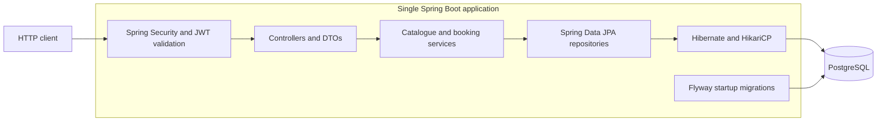

# Tbooker

A Movie Ticket Booking System built as a Java modular monolith. Phases 1–3
provide the application foundation, show catalogue, and immediate confirmed
bookings with database concurrency protection. Phase 4 verifies integration,
rollback, and concurrent booking requests; Phase 5 documents the implemented
design. Phase 6 adds BCrypt registration/login, JWT authentication, roles, and
booking ownership. Later features are planned in [the roadmap](docs/ROADMAP.md).

## Stack

- Java 21 and the checked-in Maven wrapper
- Spring Boot 3.5.16 (stable, Java 21 compatible, with JUnit 5)
- Spring MVC, Validation, Data JPA, Actuator, and Flyway
- Spring Security resource server, BCrypt, and Nimbus JOSE + JWT 10.10
- PostgreSQL 17, Docker Compose, JUnit 5, Mockito, and Testcontainers

The original application package, `com.example.Tbooker`, is retained. Authentication
is implemented; payments, temporary holds, Redis, and Kafka remain future work.

## Current functionality and architecture

- List all shows, inspect a show, and read its seat inventory through DTO APIs.
- Register and log in, then confirm one show seat using the authenticated identity.
- List and retrieve only your own bookings; ADMIN has no ownership bypass.
- Reject competing bookings using an atomic availability update and a unique
  booking constraint; roll back the seat claim if booking insertion fails.
- Apply Flyway migrations, optionally seed a development catalogue, and expose
  HTTP health plus database-aware readiness.
- Verify integration against real PostgreSQL, including 20 contending HTTP
  booking requests repeated three times with fresh fixtures.



The repository has one Maven module and one deployable application, organized
by technical layers. Catalogue and booking responsibilities are separate
services; domain module boundaries are not enforced by a module framework.
Docker Compose currently runs PostgreSQL only.

| Document | Contents |
| --- | --- |
| [HLD](docs/HLD.md) | Requirements, architecture, request flows, bottlenecks, and proposed scaling. |
| [LLD](docs/LLD.md) | Class and booking sequence diagrams, responsibilities, interfaces, and actual patterns. |
| [Database](docs/DATABASE.md) | ER diagram, column dictionary, constraints, indexes, and migrations. |
| [API](docs/API.md) | Routes, DTO fields, examples, validation, and errors. |
| [Decisions](docs/DECISIONS.md) | Rationale, alternatives, and trade-offs. |
| [Security](docs/SECURITY.md) | Authentication flow, filter chain, ownership, roles, setup, and limitations. |
| [Booking](docs/BOOKING.md) | Detailed race-condition and transaction explanation. |
| [Testing](docs/TESTING.md) | Executed test evidence, concurrency protocol, and limitations. |
| [Roadmap](docs/ROADMAP.md) | Completed phases and future milestones. |

## Local setup

Install a Java 21 **JDK**, Docker Engine or Docker Desktop, and Docker Compose v2.
Run commands from the repository root. Use `bash mvnw` on Unix, or `mvnw.cmd` on
Windows; no global Maven installation is required.

```bash
cp .env.example .env
# Edit .env: choose DB_PASSWORD and set JWT_SECRET to a fresh random Base64 key.
# Generate the JWT_SECRET value with: openssl rand -base64 32
docker compose up -d --wait postgres

# Bash: Spring Boot does not automatically read .env.
set -a
source .env
set +a
bash mvnw spring-boot:run
```

Keep `.env` private. Its values configure the host Java process and the database
container. Use shell-compatible assignments (quote values containing special
characters). PostgreSQL is exposed only on loopback. Its data lives in the
`postgres_data` named volume and survives `docker compose down`.

If port 5432 is occupied, change `DB_PORT` in `.env`. `SERVER_PORT` defaults to
8080. Credentials passed when PostgreSQL first initializes are retained in the
volume; changing `.env` later does not change database users or passwords.

| Variable | Default / purpose |
| --- | --- |
| `DB_HOST` | `localhost`; database hostname seen by the host application |
| `DB_PORT` | `5432`; Compose host port and application database port |
| `DB_NAME` | `tbooker` |
| `DB_USERNAME` | `tbooker` |
| `DB_PASSWORD` | Required for local database setup; no production secret is provided |
| `SERVER_PORT` | `8080` |
| `SPRING_DATASOURCE_URL` | Optional full JDBC URL, overrides the `DB_*` URL components |
| `SPRING_DATASOURCE_USERNAME` | Optional override of `DB_USERNAME` |
| `SPRING_DATASOURCE_PASSWORD` | Optional override of `DB_PASSWORD` |
| `SPRING_PROFILES_ACTIVE` | Unset normally; `dev` opts into sample data on a dedicated development database |
| `JWT_SECRET` | Required Base64 signing key containing at least 32 random bytes; no default |
| `JWT_ISSUER` | `tbooker` |
| `JWT_AUDIENCE` | `tbooker-api` |
| `JWT_TTL` | `PT15M`; supported range is one minute to one hour |

For a managed database, inject the `SPRING_DATASOURCE_*` variables and JWT key securely.
Do not store real credentials in Git. Compose provisions a local development
database; it is not a production database deployment configuration.

## Health and errors

```bash
curl --fail http://localhost:8080/api/v1/health
curl --fail http://localhost:8080/actuator/health
curl --fail http://localhost:8080/actuator/health/readiness
```

`GET /api/v1/health` returns `{"status":"UP"}` and checks that HTTP handling is
available. It has no business logic or persistence access, so it does not need a
pass-through service. Actuator health and readiness include the database check;
liveness does not depend on database availability. Only health is exposed from
Actuator, with component details hidden.

Security failures and Spring MVC errors use RFC 9457 Problem Details.
Missing shows return centralized `404` Problem Details; invalid IDs return `400`.
The application does not define a custom error contract for every unhandled
server failure; see [API error behavior](docs/API.md#errors).

## Development catalogue and API examples

To load sample data, opt in on a **dedicated development database**:

```bash
# With the database settings already exported:
SPRING_PROFILES_ACTIVE=dev bash mvnw spring-boot:run
# Or: java -jar target/Tbooker-0.0.1-SNAPSHOT.jar --spring.profiles.active=dev
```

The `dev` profile adds `db/dev` to Flyway's locations. It seeds one movie, one
theatre, one screen, one show, seats A1–A8, eight available show seats, and two
sample users. The show starts at `2030-01-01T18:00:00Z`; this fixed instant keeps
the sample reproducible. IDs are generated, so read them from the API. The sample
users have no password and cannot log in; register a new account as shown below.

```bash
curl --fail --silent http://localhost:8080/api/shows
# Set SHOW_ID to an id returned by that response (1 on a fresh sample database).
SHOW_ID=1
curl --fail --silent "http://localhost:8080/api/shows/$SHOW_ID"
curl --fail --silent "http://localhost:8080/api/shows/$SHOW_ID/seats"

# Error examples: 404 for an absent show, 400 for an invalid ID.
curl -i http://localhost:8080/api/shows/9223372036854775807
curl -i http://localhost:8080/api/shows/0
```

Show response (IDs are illustrative):

```json
{
  "id": 1,
  "movieId": 1,
  "movieTitle": "The Sample Adventure",
  "durationMinutes": 120,
  "screenId": 1,
  "screenName": "Screen 1",
  "theatreId": 1,
  "theatreName": "Sample Cinema",
  "city": "Bengaluru",
  "startTime": "2030-01-01T18:00:00Z"
}
```

`GET /api/shows` returns an array ordered by start time, then ID. It currently
lists all shows, including past shows; filtering and pagination are later work.
`GET /api/shows/{showId}/seats` returns an array ordered lexically by seat number,
then ID, containing objects such as:

```json
{"id": 1, "showId": 1, "seatId": 1, "seatNumber": "A1", "status": "AVAILABLE"}
```

Here `id` identifies the show-specific inventory row and `seatId` identifies the
physical seat. Availability belongs to the show-specific row. An existing show
without inventory returns `[]`; an absent show returns `404` for both detail and
seat routes. Catalogue administration endpoints are not implemented.

The development repeatable migration reuses existing sample rows and does not
reset seat statuses. Flyway normally reruns it only when its checksum changes;
executing its SQL again is also idempotent. Normal startup loads no sample data.
Do not switch a seeded database between `dev` and non-dev configurations: its
Flyway history includes the development migration. Use separate databases and
never activate `dev` against production.

## Authentication and booking API

Register a local account, then log in. Replace the example password with your own
private password of at least 12 characters (at most 72 UTF-8 bytes).

```bash
curl -i -X POST http://localhost:8080/api/auth/register \
  -H 'Content-Type: application/json' \
  --data '{"name":"Demo User","email":"demo@example.test","password":"replace-with-private-password"}'

curl --fail -X POST http://localhost:8080/api/auth/login \
  -H 'Content-Type: application/json' \
  --data '{"email":"demo@example.test","password":"replace-with-private-password"}'

# Copy accessToken from the login response. Do not commit or publish tokens.
TOKEN=paste-access-token-here
SHOW_ID=1
SHOW_SEAT_ID=5
curl -i -X POST "http://localhost:8080/api/shows/$SHOW_ID/bookings" \
  -H "Authorization: Bearer $TOKEN" -H 'Content-Type: application/json' \
  --data "{\"showSeatId\":$SHOW_SEAT_ID}"

curl --fail http://localhost:8080/api/bookings -H "Authorization: Bearer $TOKEN"
# Replace 1 with your returned booking ID.
curl --fail http://localhost:8080/api/bookings/1 -H "Authorization: Bearer $TOKEN"
```

Use actual show/inventory IDs from the catalogue. `showSeatId` is the inventory
response's `id`, not its physical `seatId`. Do not send `userId`: the controller
uses the validated JWT subject, and a body containing `userId` returns `400`.

Registration returns `201` with the new user's ID, name, email, and `USER` role.
Login returns an access token, `Bearer` token type, and lifetime in seconds.
Duplicate emails return `409`; invalid credentials return a generic `401`.
Passwords are stored only as salted BCrypt hashes. Signing keys come from the
environment; there are no default account passwords or ADMIN credentials.

Successful booking returns `201` after the seat claim and booking commit:

```json
{
  "id": 1,
  "userId": 3,
  "showId": 1,
  "showSeatId": 5,
  "status": "CONFIRMED",
  "createdAt": "2026-10-09T03:00:00Z"
}
```

IDs and times are illustrative. Repeating the booking returns `409`; request
idempotency is not implemented. Missing/invalid bearer tokens return `401`.
Booking detail returns `404` for both a nonexistent booking and another user's
booking; lists contain only the caller's bookings, including for ADMIN callers.

Catalogue reads stay public. Catalogue writes and the reserved `/api/admin/**`
namespace require ADMIN, but mutation handlers are not implemented. A trusted
operator may promote a registered account in the database; there is no public
role assignment API. Existing tokens retain their role until expiry. See
[API contracts](docs/API.md), [security design](docs/SECURITY.md), and the
[booking transaction design](docs/BOOKING.md).

## Database migrations

Flyway runs on application startup and validates migration checksums. V1 creates
the `tbooker` schema, V2 creates the seven catalogue tables and constraints, and
V3 creates bookings with a unique constraint on the show seat. V4 adds password
hashes and roles while preserving existing users and bookings. Legacy accounts
without a hash cannot log in.
Migration history is in `public.flyway_schema_history`. Hibernate uses the
`tbooker` schema with `ddl-auto: validate`; it does not create or alter tables.

Add new files in `src/main/resources/db/migration` using
`V<version>__<description>.sql`. Never edit a migration already applied to a shared
database. Flyway clean is disabled. The initial migration expects a database
without an existing `tbooker` schema; do not enable automatic baselining to hide
an existing schema mismatch.

See [the database design](docs/DATABASE.md) for relationships, indexes, UTC
handling, and the database-enforced show/seat screen invariant.

## Build and tests

```bash
bash mvnw clean verify
```

The full suite requires a running Docker daemon. Tests generate a random JWT key;
no production key or `.env` is required. Testcontainers creates isolated
PostgreSQL containers on random ports, applies Flyway migrations, and cleans them
up after testing. Tests use container connection details and do not depend on
the Compose database or a developer's database credentials. The first run pulls
the PostgreSQL and Testcontainers helper images.

The suite checks health, catalogue responses, Problem Details, application
startup, migration validation, JPA relationships, database constraints, UTC
handling, and seed repeatability. It also checks that the default profile loads
no sample data and that the same physical seat has independent availability in
different shows. Booking tests verify independent committed transactions,
deterministic row contention, rollback after an insert failure, duplicate
protection, and API validation. Mockito is available through
`spring-boot-starter-test`.

Phase 4 adds a real HTTP test with 20 simultaneous requests, repeated three times
with fresh fixtures. Every run requires exactly one `201`, nineteen `409`
responses, one booking, and a `BOOKED` seat. The test-only connection pool allows
all 20 transactions to contend at PostgreSQL. Migration checks call Flyway again
and verify that migration history and application data remain unchanged.

See [TESTING.md](docs/TESTING.md) for execution details and remaining weaknesses.
The full suite was rerun during Phase 6: **125 tests passed,
0 failures, 0 errors, 0 skipped**. These are correctness results, not performance
measurements.

Run only the PostgreSQL booking tests with:

```bash
bash mvnw -Dtest=BookingIntegrationTests,BookingConcurrencyIntegrationTests test
```

Without Docker, run the HTTP slice tests only:

```bash
bash mvnw -Dtest=HealthControllerTests test
```

That command does not validate database integration. Tests are not automatically
skipped when Docker is unavailable.

Run the packaged application after a successful build:

```bash
# Export the database settings as shown above first.
java -jar target/Tbooker-0.0.1-SNAPSHOT.jar
```

## Structure

Under `src/main/java/com/example/Tbooker`:

| Package | Responsibility |
| --- | --- |
| `controller` | HTTP mapping and DTO validation; thin controllers |
| `service` | Use cases and transaction boundaries |
| `repository` | Persistence access |
| `entity` | JPA domain entities, kept out of API bodies |
| `dto` | API request and response types |
| `exception` | Domain exceptions and centralized HTTP mappings |
| `config` | Security filter chain, JWT/key configuration, and authentication error responses |

Unused packages contain package documentation, not speculative implementations.
As domain modules arrive, preserve Controller → Service → Repository dependency
direction and establish explicit boundaries inside this single application.

See [AGENTS.md](AGENTS.md) for development conventions.

## Future roadmap and current limits

Later phases will define catalogue administration, filters and pagination,
overlap-aware scheduling, seat holds, cancellation, and request idempotency.
Later identity work includes password reset, email verification, and token revocation.
Payment integration follows its own requirements. Redis
caching and Kafka workflows are proposals for demonstrated needs, not installed
components. Delivery work still includes an application Dockerfile, CI, and
deployment/backup procedures. See the [roadmap](docs/ROADMAP.md).

Currently, a booking retry after a lost success response returns `409` instead
of recovering the first result. There is no booking-specific database lock or
statement timeout, no past-show booking cutoff, and no scheduling overlap check.
Direct SQL can make seat status disagree with booking existence, although the
supported service transaction maintains both atomically. JWTs currently have no
refresh/revocation flow, role changes wait for token expiry, and auth endpoints
have no rate limiting. Legacy accounts need a future trusted enrollment flow. The tests establish the described correctness
properties on one application/database instance, not production performance,
failover readiness, or a capacity guarantee.
