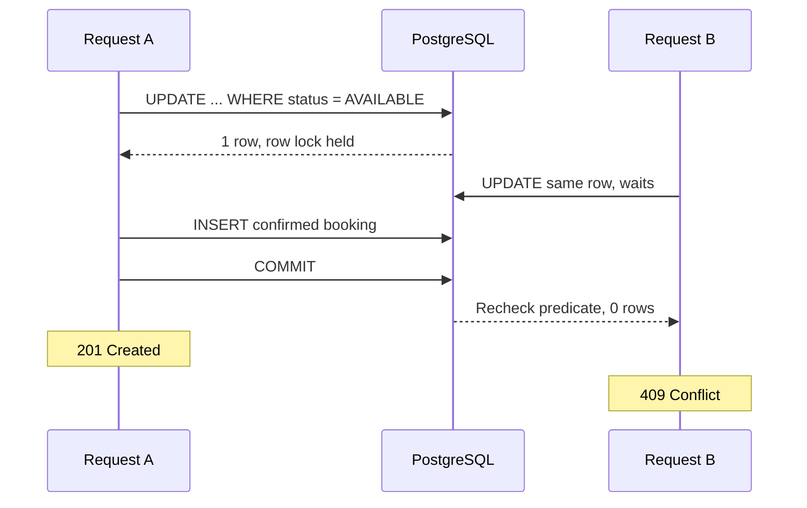

# Immediate confirmed bookings

`POST /api/shows/{showId}/bookings` books one show-specific seat for one existing
authenticated user. The response is `201` with a `CONFIRMED` booking after commit.
The Phase 3 concurrency design is preserved in Phase 6. JWT authentication now
establishes identity before the service transaction; there are still no holds,
cancellation, payment calls, or idempotency keys. See [SECURITY.md](SECURITY.md).

## Request and outcomes

```json
{"showSeatId": 5}
```

Use the `id` from `GET /api/shows/{showId}/seats`, not its physical `seatId`.
Send `Authorization: Bearer <accessToken>`. `userId` comes from the validated
principal; including it in the request body is rejected. Own-booking list/detail
routes are `GET /api/bookings` and `GET /api/bookings/{bookingId}`. Their repository
queries include the owner ID, including for ADMIN callers; foreign details return
the same `404` as an absent booking.

| Status | Meaning |
| --- | --- |
| `201` | Confirmed booking committed; the show seat is now `BOOKED`. |
| `400` | Missing, malformed, non-positive, fractional, or overflowing IDs; malformed JSON; or an existing show seat belongs to another show. |
| `401` | Missing or invalid bearer token. |
| `404` | The show, user, or show seat does not exist. |
| `409` | The conditional update cannot claim an available seat, or the unique booking constraint rejects a duplicate. |
| `500` | Unexpected database integrity failure; the transaction rolls back and the response does not expose database internals. |

Failures use Problem Details. Validation checks the show, then user, then show
seat existence and association. Availability is decided by the database update,
not by the pre-read entity. Repeating a successful request returns `409`, even
for the same user; request idempotency is future work.

## The race in check-then-save

Two independent requests can both read `AVAILABLE` before either writes. If both
then unconditionally save a booking, both can believe they succeeded. A Java
lock would also protect only one application process. Reading status or adding
`@Transactional` by itself does not remove this race.

The winning decision is instead made by one PostgreSQL statement:

```sql
UPDATE tbooker.show_seats
SET status = 'BOOKED'
WHERE id = :showSeatId
  AND show_id = :showId
  AND status = 'AVAILABLE';
```

`BookingService.book` runs at `READ COMMITTED`. An update locks the matching row
until the transaction ends. If another transaction tries to update that row, it
waits. When the first transaction commits, PostgreSQL re-evaluates the `WHERE`
condition against the updated row. Its status is now `BOOKED`, so the waiting
update affects zero rows and returns `409`. Exactly one affected row permits the
booking insert. This works across application instances sharing the database.

If the first transaction rolls back instead, its `BOOKED` change disappears.
The waiting update can then match `AVAILABLE` and proceed. A different seat has
its own row, so the implementation does not lock an entire show or all bookings.



## Why one transaction is required

The seat claim and booking insertion form a single unit of work. Spring's
transaction interceptor opens the transaction before the service runs and
commits before returning to the controller. `saveAndFlush` forces insert-time
constraints to be checked in that transaction. Runtime exceptions escape the
service and roll back both writes before global error handling runs.

Without this boundary, a failed insert could leave a seat permanently marked
`BOOKED` with no booking. Conversely, committing a booking before its seat change
would leave inconsistent inventory. There are no external network/payment calls
inside the transaction, and confirmation does not wait for payment.

The native update clears JPA's persistence context so an earlier loaded seat
does not retain a misleading `AVAILABLE` status. Fresh references by ID are used
for the new booking. The response contains scalar DTO fields, not JPA entities.

## Why database constraints remain necessary

V3 adds `UNIQUE (show_seat_id)` as `uq_bookings_show_seat`. Even if a future code
path bypasses the conditional update, or someone incorrectly resets inventory,
the database still rejects a second booking for that show seat. User and show-seat
foreign keys prevent dangling references; a check constraint restricts booking
status to `CONFIRMED`. Previous migrations and their checksums are unchanged.

Only PostgreSQL unique violation `23505` for `uq_bookings_show_seat` maps to a
duplicate-booking `409`. Other integrity failures are logged and return a generic
`500`; they are not falsely reported as an already-booked seat.

The unique constraint protects booking uniqueness, not every possible
cross-table inconsistency introduced by direct SQL. There is no trigger requiring
every `BOOKED` seat to have a booking. The supported write path preserves that
invariant through its transaction. If data is already inconsistent, an insert
failure rolls back to its previous state; it does not silently repair it.

The unique constraint is unconditional because cancellation and booking history
are not implemented yet. A later lifecycle phase must deliberately redesign it
before allowing a cancelled seat to be booked again.

## Verification

`BookingIntegrationTests` uses real Testcontainers PostgreSQL and has no outer
test transaction. Every request commits or rolls back independently. It covers:

- Confirmed booking persistence, UTC creation time, and updated catalogue status.
- Duplicate requests by the same and different users.
- Missing resources, invalid IDs/bodies, and mismatched show-seat associations.
- Test-only `BEFORE INSERT` and `AFTER INSERT` triggers that fail after the seat
  update; neither write persists, and a subsequent retry succeeds.
- Direct SQL duplicate protection and the unique-constraint fallback when a
  seat status was incorrectly reset.
- Two requests blocked on the same PostgreSQL row before releasing the lock;
  exactly one receives `201`, one receives `409`, and one booking exists.
- A waiting request succeeding after a competing transaction rolls back.
- Independent bookings for the same physical seat across different shows.
- Replaying development seed SQL without undoing a confirmed booking.
- Repeating Flyway migrations without changing history or any application rows.

The lock tests poll `pg_stat_activity` to establish actual blocked conditional
updates before releasing the coordinating lock; they do not depend on a lucky
thread schedule or an arbitrary sleep before sending a second request.

`BookingConcurrencyIntegrationTests` additionally runs a real HTTP server and
releases 20 distinct users' requests together with `CountDownLatch`. All 20 must
carry a real signed JWT and reach the database update before a coordinating row
lock is released. Across
three isolated repetitions, each race requires one `201`, nineteen `409` responses,
one confirmed booking, a `BOOKED` seat, and no duplicate bookings.

Run the full suite with `bash mvnw clean verify`, or both booking test classes
with `bash mvnw -Dtest=BookingIntegrationTests,BookingConcurrencyIntegrationTests test`.
Docker is required. See [TESTING.md](TESTING.md) for the test protocol, review
findings, and limits of these results.
