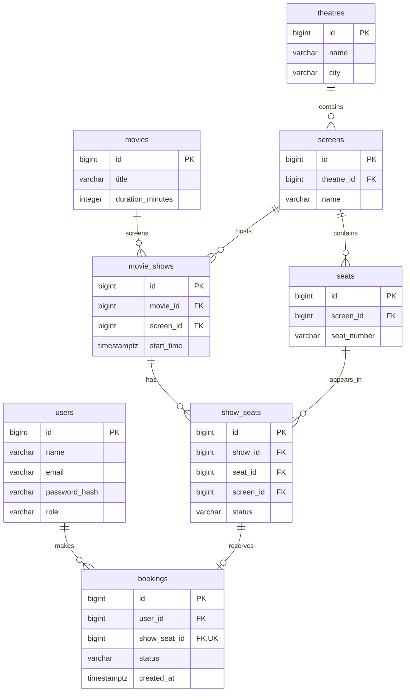

# Database design

PostgreSQL is the source of truth for catalogue inventory and bookings. Domain
tables are in schema `tbooker`; Flyway history is in `public.flyway_schema_history`.
The SQL migrations, linked below, are authoritative for schema changes.

## Relationships

The diagram shows cardinalities; composite keys and expression indexes are
specified below. Each physical seat belongs to one screen. Each show belongs to
one movie and one screen. A `ShowSeat` is inventory for one physical seat at one
show, so A1 can be booked for one show and remain available for another.

## Column dictionary

Every column below is `NOT NULL` except `users.password_hash`, which remains null
for legacy accounts without login credentials. All eight tables have the same primary-key
definition: `id BIGINT GENERATED BY DEFAULT AS IDENTITY PRIMARY KEY`, mapped to
Java `Long` with `GenerationType.IDENTITY`. Identity values may have gaps after
rollbacks or conflict handling and are not fixed sample-data identifiers.
Other defaults exist only where explicitly listed.

| Table / JPA entity | Column | PostgreSQL type | Meaning / restriction |
| --- | --- | --- | --- |
| `users` / `User` | `name` | `VARCHAR(120)` | Name; `btrim(name) <> ''`. |
| | `email` | `VARCHAR(254)` | `btrim(email) <> ''`; unique on `lower(email)`. |
| | `password_hash` | `VARCHAR(60)` | Nullable for legacy users; otherwise BCrypt format. Never returned by an API. |
| | `role` | `VARCHAR(20)` | Default `USER`; constrained to `USER` or `ADMIN`. |
| `movies` / `Movie` | `title` | `VARCHAR(200)` | `btrim(title) <> ''`; titles need not be unique. |
| | `duration_minutes` | `INTEGER` | Must be greater than zero. |
| `theatres` / `Theatre` | `name` | `VARCHAR(200)` | `btrim(name) <> ''`; not globally unique. |
| | `city` | `VARCHAR(120)` | `btrim(city) <> ''`; stored as a string. |
| `screens` / `Screen` | `theatre_id` | `BIGINT` | FK to `theatres.id`. |
| | `name` | `VARCHAR(100)` | `btrim(name) <> ''`; unique within a theatre. |
| `seats` / `Seat` | `screen_id` | `BIGINT` | FK to `screens.id`. |
| | `seat_number` | `VARCHAR(20)` | `btrim(seat_number) <> ''`; unique within a screen. |
| `movie_shows` / `MovieShow` | `movie_id` | `BIGINT` | FK to `movies.id`. |
| | `screen_id` | `BIGINT` | FK to `screens.id`. |
| | `start_time` | `TIMESTAMP WITH TIME ZONE` | Absolute show start instant. |
| `show_seats` / `ShowSeat` | `show_id` | `BIGINT` | Show component of the composite FK described below. |
| | `seat_id` | `BIGINT` | Physical-seat component of the composite FK. |
| | `screen_id` | `BIGINT` | Shared screen value in both composite FKs. |
| | `status` | `VARCHAR(20)` | Default `AVAILABLE`; check permits `AVAILABLE` or `BOOKED`. |
| `bookings` / `Booking` | `user_id` | `BIGINT` | FK to `users.id`. |
| | `show_seat_id` | `BIGINT` | FK to `show_seats.id`; unique across bookings. |
| | `status` | `VARCHAR(20)` | Check permits only `CONFIRMED`; supplied by the application. |
| | `created_at` | `TIMESTAMP WITH TIME ZONE` | Creation instant supplied by the application; no database default. |

`users` avoids the SQL `USER` keyword. Email uniqueness ignores case but does not
trim or normalize stored data or validate email syntax. The text checks reject
values empty after PostgreSQL's default `btrim`; they are not comprehensive
validation of all Unicode whitespace. Registration validates email syntax and
normalizes its case in the service. There are no payment columns or plaintext
passwords. V4 adds `ck_users_role` and `ck_users_password_hash`; the latter checks
the BCrypt storage format, while password verification belongs to the encoder.

## Keys, constraints, and indexes

Primary keys and unique constraints create PostgreSQL indexes automatically.
Foreign keys alone do not. The following are the explicit non-primary indexes
and unique constraints present in V2 and V3 (V4 does not add indexes):

| Name | Definition | Purpose |
| --- | --- | --- |
| `uq_users_email` | Unique expression index on `users(lower(email))` | Reject case-only email duplicates. |
| `uq_screens_theatre_name` | Unique `(theatre_id, name)` | Scope screen names to a theatre; supports theatre lookups. |
| `uq_seats_screen_number` | Unique `(screen_id, seat_number)` | Scope seat numbers to a screen. |
| `uq_seats_id_screen` | Unique `(id, screen_id)` | Referenced key for same-screen inventory enforcement. |
| `uq_movie_shows_screen_start` | Unique `(screen_id, start_time)` | Reject identical starts on a screen. |
| `uq_movie_shows_id_screen` | Unique `(id, screen_id)` | Referenced key for same-screen inventory enforcement. |
| `ix_movie_shows_movie` | Index `(movie_id)` | Support movie references/lookups. |
| `ix_movie_shows_start_id` | Index `(start_time, id)` | Match show-list ordering. |
| `uq_show_seats_show_seat` | Unique `(show_id, seat_id)` | One inventory row per show and physical seat; supports show filtering. |
| `ix_show_seats_seat_screen` | Index `(seat_id, screen_id)` | Support physical-seat composite references/lookups. |
| `uq_bookings_show_seat` | Unique `(show_seat_id)` | At most one booking per inventory row. |
| `ix_bookings_user` | Index `(user_id)` | Support user references/lookups. |

The conditional booking update identifies a row by its primary key; there is no
separate status index. Seat-list ordering includes a join to physical seat
numbers, so the show inventory index does not imply a sort-free query. Index
choices have not been backed by production traffic measurements.

### Same-screen invariant

`show_seats.screen_id` is deliberate redundancy beyond the public API model.
Two composite foreign keys must agree on it:

- `fk_show_seats_show_screen`: `(show_id, screen_id)` references
  `movie_shows(id, screen_id)`.
- `fk_show_seats_seat_screen`: `(seat_id, screen_id)` references
  `seats(id, screen_id)`.

Consequently, a show cannot reference a seat from another screen even through
direct SQL. The parent composite unique constraints make these references legal.
JPA maps the show and seat as lazy associations and the supporting screen ID as
a scalar column. Its constructor also checks screen equality. The API does not
expose this extra inventory column.

### Booking integrity and lifecycle limits

`fk_bookings_user` and `fk_bookings_show_seat` require existing resources.
`uq_bookings_show_seat` is unconditional: even a future status would not permit a
second booking for the same inventory row. Current status checks are named
`ck_show_seats_status` and `ck_bookings_status`.

All foreign keys use default `NO ACTION` behavior with no delete cascades. There
are also no JPA remove cascades. Referenced catalogue data cannot be silently
deleted with its bookings.

The service transaction maintains `BOOKED` plus one confirmed booking together.
The schema does not contain a trigger requiring those two facts to agree. Direct
SQL could leave a booked seat without a booking or an available seat with one;
uniqueness prevents duplicate bookings but does not repair that inconsistency.
See [BOOKING.md](BOOKING.md) for the atomic update and rollback mechanics.

Scheduling rejects equal `(screen_id, start_time)` values, not overlapping show
intervals. No database constraint rejects a show in the past. Holds, cancellation
history, and rebooking need a later schema and lifecycle decision.

## UTC and precision

`MovieShow.startTime` and `Booking.createdAt` use Java `Instant` and PostgreSQL
`timestamptz` (`TIMESTAMP WITH TIME ZONE`). PostgreSQL represents an instant rather
than retaining the original time-zone name; display depends on the session zone.
Hibernate JDBC time zone is UTC, and Hikari initializes application connections
with `SET TIME ZONE 'UTC'`. API instants serialize with a `Z` UTC suffix.

Booking creation time comes from the application clock, truncated to microseconds
to match database precision. A future multi-instance deployment must account for
clock synchronization; this field is not a global transaction-ordering sequence.

## Flyway lifecycle

| Migration | Responsibility |
| --- | --- |
| [V1__create_application_schema.sql](../src/main/resources/db/migration/V1__create_application_schema.sql) | Create schema `tbooker`. |
| [V2__create_show_catalogue.sql](../src/main/resources/db/migration/V2__create_show_catalogue.sql) | Create the seven catalogue tables, checks, relationships, and indexes. |
| [V3__create_bookings.sql](../src/main/resources/db/migration/V3__create_bookings.sql) | Add bookings and their integrity constraints. |
| [V4__add_user_credentials_and_roles.sql](../src/main/resources/db/migration/V4__add_user_credentials_and_roles.sql) | Add BCrypt hashes and USER/ADMIN roles without changing existing IDs or bookings. |
| [R__sample_catalogue.sql](../src/main/resources/db/dev/R__sample_catalogue.sql) | Opt-in development sample data. |

Flyway applies pending migrations at startup and validates applied checksums.
Hibernate uses `ddl-auto: validate`; Flyway clean is disabled. Add a new versioned
migration for schema changes and never edit an applied shared migration. V1
expects a database without an existing `tbooker` schema; automatic baselining is
not configured.

Repeated `Flyway.migrate()` calls on an unchanged database apply no migrations
and preserve history and rows. This does not mean the versioned SQL files can be
manually replayed: their DDL is deliberately managed by Flyway history. The
integration suite checks repeated migration calls after a successful booking.

## Development data

V4 leaves existing users with `password_hash = NULL` and `role = 'USER'`. They
retain their bookings but cannot log in. There is no default password or public
credential-enrollment endpoint for those accounts. The development seed also
creates credential-less sample users; register a new user for authenticated API
examples. Operator-controlled ADMIN promotion and identity limitations are in
[SECURITY.md](SECURITY.md#migration-and-admin-provisioning).

Only the `dev` profile adds `classpath:db/dev` to migration locations. A fresh
development database receives:

| Resource | Sample |
| --- | --- |
| Movie | `The Sample Adventure`, 120 minutes |
| Theatre | `Sample Cinema`, `Bengaluru` |
| Screen | `Screen 1` |
| Physical seats | A1 through A8 |
| Show | `2030-01-01T18:00:00Z` on the sample screen |
| Show seats | Eight initially `AVAILABLE` inventory rows |
| Users | Alex Sample (`alex@example.test`), Priya Sample (`priya@example.test`) |

The seed uses natural lookups and `ON CONFLICT DO NOTHING` to reuse sample rows;
it does not reset availability or overwrite existing bookings. Flyway serializes
migration execution and reruns a repeatable migration when its checksum changes.
Replaying this seed SQL is also tested for duplicate-free, status-preserving
behavior; it is not a catalogue repair or synchronization job.

Normal startup seeds nothing. Use a dedicated development database: removing the
`dev` location from a database that already records its repeatable migration can
fail migration validation. IDs are generated, so inspect API/SQL results instead
of relying on the illustrative IDs in examples. See [local setup](../README.md#local-setup).
