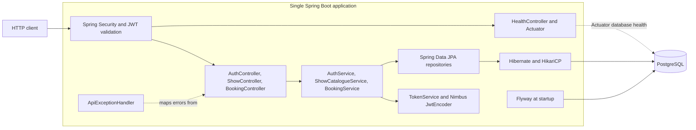

# High-level design

This document describes the implemented backend through Phase 6. Proposed
extensions are explicitly marked as future work. See [LLD](LLD.md) for classes,
[database design](DATABASE.md) for constraints, and [API](API.md) for contracts.

## Requirements and scope

The application lets a client list shows, inspect a show and its seat inventory,
and immediately confirm one seat for an authenticated user. Users register,
log in, and read only their own bookings. A physical seat can be
booked independently for different shows. Missing resources, invalid requests,
and already-booked seats have distinct HTTP responses.

The central correctness requirement is that two requests cannot both commit a
booking for the same show-seat row. Seat availability and its booking must commit
or roll back together. Other requirements are repeatable schema migrations,
UTC timestamps, DTO-based HTTP contracts, and PostgreSQL integration tests.

Authentication uses BCrypt and JWT with USER/ADMIN roles. There is no payment,
temporary hold, cancellation, catalogue administration, search, filtering, or
pagination. ADMIN authorization is configured for future catalogue mutations,
but no mutation handlers exist. Public deployment also needs the security and
operational controls described in [SECURITY.md](SECURITY.md).
No throughput, latency, availability SLA, or capacity target has been measured
or established in this project.

## Current architecture

Tbooker is one Spring Boot application, one Maven module, and one PostgreSQL
database. It follows a modular monolith direction, with catalogue and booking
responsibilities separated into services. The current code is organized by
technical layer; domain module boundaries are not enforced by separate modules
or an architecture framework.



For local development, Docker Compose runs PostgreSQL only; the Java application
runs on the host. There is no application Dockerfile, deployed load balancer,
cache, message broker, or separate worker in the repository.

## Main components

| Component | Implemented responsibility |
| --- | --- |
| Spring MVC controllers | Bind paths and JSON, validate inputs, return DTOs and HTTP statuses. |
| Spring Security | Validate bearer tokens, create the principal, and apply public/USER/ADMIN route rules. |
| `AuthService` / `TokenService` | Register BCrypt credentials, verify login, and issue short-lived signed JWTs. |
| `ShowCatalogueService` | Read shows and inventory in read-only transactions; build response records. |
| `BookingService` | Validate associations, atomically book a seat, and query only the authenticated user's bookings. |
| Spring Data repositories | Fetch catalogue data, execute the conditional SQL update, and persist bookings. |
| PostgreSQL | Store eight domain tables and enforce identities, relationships, checks, and uniqueness. |
| Flyway | Apply versioned schema changes and, only under `dev`, repeatable sample data. |
| `ApiExceptionHandler` | Translate domain exceptions and selected database failures into Problem Details. |
| Health endpoints | Lightweight HTTP health plus Actuator liveness and database-aware readiness. |

Hibernate validates the Flyway-managed schema; it does not generate DDL.
Open-in-view is disabled, so DTO construction happens inside service transactions.
Entity graphs fetch the relationships required by catalogue responses.

## Request flows

For a catalogue request, the controller calls `ShowCatalogueService`, which
reads through repositories and maps entities to records before its transaction
ends. Show lists are ordered by start time and ID; seat lists are ordered by seat
number and ID. Lists are unpaged. A returned availability value is a snapshot,
not a reservation or a guarantee that a later booking will succeed.

For a booking, Spring Security validates the bearer token first. The controller
derives the user ID from its subject; the body contains only `showSeatId` and
cannot select another user. Spring MVC validates IDs and the request body. The
transactional service checks the show, user, show-seat existence, and show-seat
association. It atomically changes an available inventory row to `BOOKED`, then
inserts a `CONFIRMED` booking. The transaction commits before the controller
returns `201`. Failures roll back the transaction before HTTP error translation.
See the [booking sequence](LLD.md#booking-sequence).

Registration stores a BCrypt hash and returns a user DTO; login verifies the hash
and issues a JWT. Booking reads combine the authenticated owner ID with the
requested booking ID, returning `404` for foreign records. ADMIN has no override
for ownership. See the [security flow](SECURITY.md#spring-security-filter-chain).

## Database choice and consistency

PostgreSQL fits the relational model and the need to coordinate two writes in
one transaction. Foreign keys prevent dangling references, composite foreign
keys prevent cross-screen inventory, and unique constraints protect identifiers
within their intended scope. PostgreSQL is also used by Testcontainers, so tests
exercise the database's actual locking and SQL semantics.

Availability lives on `ShowSeat`, not `Seat`. This makes `(show, physical seat)`
the inventory unit. A booking references exactly one such unit. The current
application uses one writable database and synchronous transactions; no replicas
or eventual-consistency workflows are configured.

## Concurrency protection

A read-then-save availability check would allow two transactions to read
`AVAILABLE` before either writes. Instead, the service uses this statement:

```sql
UPDATE tbooker.show_seats
SET status = 'BOOKED'
WHERE id = :showSeatId AND show_id = :showId AND status = 'AVAILABLE';
```

At the service's explicit `READ COMMITTED` isolation level, competing updates
wait on the same PostgreSQL row. After a winner commits, PostgreSQL re-evaluates
the predicate against the updated row: waiting requests affect zero rows and
receive `409`. If the contender holding the row rolls back, a waiting request
can claim the still-available seat.

`@Transactional` covers both the update and insert, retaining the row lock until
completion. An insert failure therefore releases the seat through rollback.
`UNIQUE (show_seat_id)` on bookings is an independent final guard against
duplicate rows, including writes that bypass the service. It does not by itself
enforce agreement between the seat's status and the existence of a booking;
that consistency depends on the supported transaction path.

The Phase 4 tests exercise 20 independent HTTP requests against one seat, repeated
three times, and verify exactly one committed booking per repetition. These are
correctness tests on one application and database instance, not performance or
multi-instance resilience measurements. See [test evidence](TESTING.md).

## Potential bottlenecks and current limitations

| Area | Implication |
| --- | --- |
| A popular seat | Updates serialize on its row. More application instances cannot make that seat accept multiple bookings. |
| Connection and HTTP worker pools | Waiting requests consume resources. Production pool sizing has not been tuned; the concurrency test's 24-connection pool is test-only. |
| Long database transactions | No booking-specific lock or statement timeout is configured. A connection-acquisition timeout does not bound an active SQL wait. |
| Unpaged catalogue reads | Result size, DTO allocation, serialization, and sorting grow with the catalogue. Existing indexes do not eliminate every join or sort. |
| Booking lookups | Resource checks add database round trips before the update and insert. No latency claim is made. |
| Registration and login | BCrypt costs CPU; registration holds a database transaction during hashing. Rate limiting and production sizing are not implemented. |
| Single database | It is the common write dependency. Backups, failover, recovery procedures, and production monitoring are not configured here. |
| Client retries | A committed booking with a lost HTTP response is ambiguous to the client; retry returns `409`, with no idempotency lookup. |

There is also no rule rejecting bookings for past shows, and scheduling only
rejects equal start times on the same screen, not overlapping time ranges.

## Scaling considerations — future work

Measure query plans, traffic, lock waits, connection usage, and response latency
before selecting optimizations. Add pagination and filters before relying on
caching to cover unbounded catalogue reads. Tune indexes and bounded timeouts
using those measurements and define retry/error semantics alongside them.

The database-mediated booking guard does not depend on a Java process lock.
Multiple application instances could therefore share the same PostgreSQL writer,
but load balancing, aggregate connection budgeting, migration rollout, and
multi-instance failure tests would be necessary before claiming that deployment
is verified. Read replicas could serve appropriately stale catalogue data later;
booking validation and claims must retain an authoritative write path.

Extract services only when independent ownership, deployment, or scaling needs
justify the additional consistency and operational work. The present booking
transaction benefits from keeping inventory and bookings in one database.

## Security considerations

JWT validation is stateless, so future application replicas would not need a
shared session store. They would need synchronized clocks and the same trusted
issuer/audience/key configuration. HS256 verification shares signing authority;
separate services may later justify asymmetric keys. Role checks protect routes,
while owner-scoped repository queries protect individual booking records.

Tokens are signed, not encrypted, and have no immediate revocation flow. Role
changes remain stale until token expiry; no refresh or key-rotation protocol is
implemented. TLS termination, login abuse controls, secret management, and audit
operations are required deployment work. See [SECURITY.md](SECURITY.md) for the
filter chain, key configuration, and explicit limitations.

## Redis and Kafka — proposed, not implemented

**Redis:** A future cache could serve frequently read movie, theatre, and show
metadata. It would need bounded TTLs, invalidation rules, and a database fallback.
Cached seat availability can become stale immediately; PostgreSQL's conditional
claim and constraints must remain authoritative. Temporary holds require their
own ownership, expiry, and recovery design before choosing Redis as a component.
There are currently no cache clients, Redis locks, or hold states.

**Kafka:** Future notifications or analytics could consume booking events after
commit. A transactional outbox would insert an event in the same database
transaction as the booking; a separate publisher would deliver it to Kafka.
This avoids a database-plus-broker dual write in the request transaction. Such a
design must handle at-least-once delivery, idempotent consumers, ordering needs,
retries, and replay. No outbox table, publisher, topic, or consumer exists today.

Payment integration likewise needs a later lifecycle design. External payment
calls must not hold the current seat transaction open. See [decisions](DECISIONS.md)
and the [roadmap](ROADMAP.md) for the boundaries of future phases.
