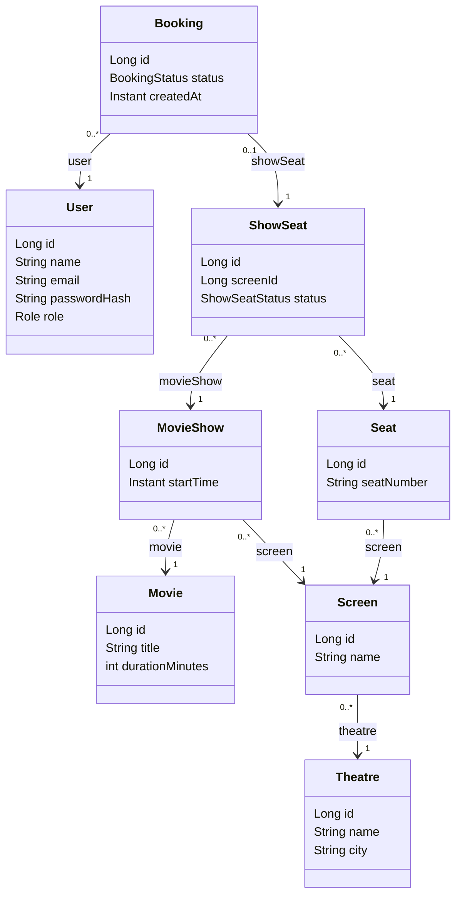
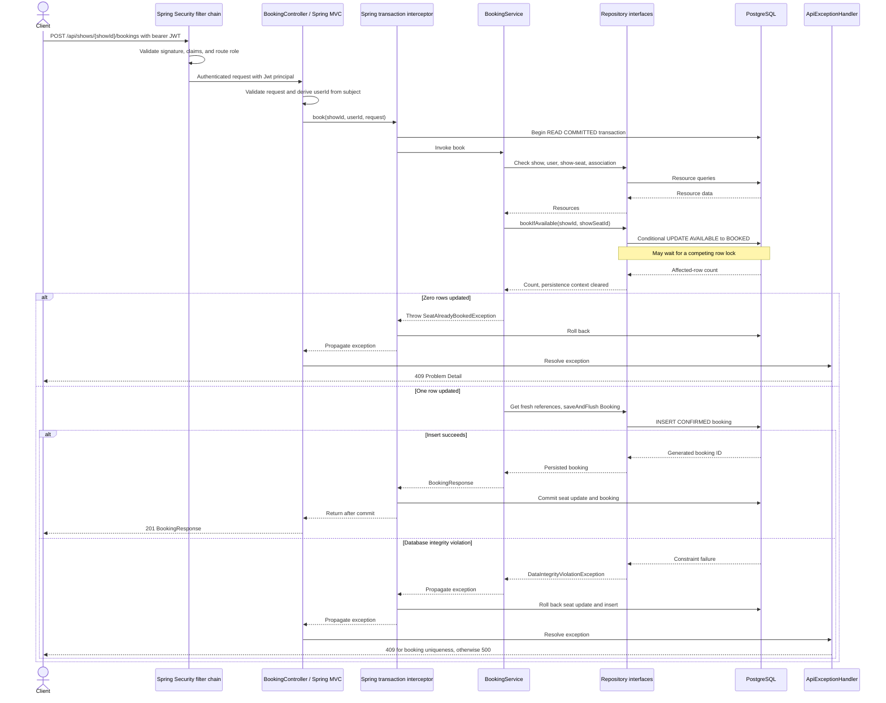

# Low-level design

The implementation lives under `com.example.Tbooker`. It uses controllers,
concrete service classes, Spring Data repository interfaces, JPA entities, DTO
records, centralized exceptions, and Spring Security configuration.
[HLD](HLD.md) describes deployment and scope;
[DATABASE](DATABASE.md) defines the physical schema.

## Class diagram and interfaces

The following diagram shows application dependencies. `JpaRepository` is a
framework interface; Spring Data generates the repository implementations.

```mermaid
classDiagram
    class ShowController {
        +getShows() List~ShowResponse~
        +getShow(Long showId) ShowResponse
        +getShowSeats(Long showId) List~ShowSeatResponse~
    }
    class BookingController {
        +book(Long showId, BookingRequest request, Jwt principal) ResponseEntity~BookingResponse~
        +getBookings(Jwt principal) List~BookingResponse~
        +getBooking(Long bookingId, Jwt principal) BookingResponse
    }
    class AuthController {
        +register(RegisterRequest request) ResponseEntity~UserResponse~
        +login(LoginRequest request) AuthResponse
    }
    class AuthService {
        +register(RegisterRequest request) UserResponse
        +login(LoginRequest request) AuthResponse
    }
    class TokenService {
        +issue(User user) AuthResponse
    }
    class PasswordEncoder {
        <<interface>>
    }
    class JwtEncoder {
        <<interface>>
    }
    class ShowCatalogueService {
        +getShows() List~ShowResponse~
        +getShow(Long showId) ShowResponse
        +getShowSeats(Long showId) List~ShowSeatResponse~
    }
    class BookingService {
        +book(Long showId, Long userId, BookingRequest request) BookingResponse
        +getBookings(Long userId) List~BookingResponse~
        +getBooking(Long bookingId, Long userId) BookingResponse
    }
    class JpaRepository {
        <<interface>>
    }
    class MovieShowRepository {
        <<interface>>
        +findAllByOrderByStartTimeAscIdAsc() List~MovieShow~
        +findById(Long id) Optional~MovieShow~
    }
    class ShowSeatRepository {
        <<interface>>
        +findByMovieShowIdOrderBySeatSeatNumberAscIdAsc(Long showId) List~ShowSeat~
        +bookIfAvailable(Long showId, Long showSeatId) int
    }
    class UserRepository {
        <<interface>>
        +findByEmailIgnoreCase(String email) Optional~User~
        +existsByEmailIgnoreCase(String email) boolean
    }
    class BookingRepository {
        <<interface>>
        +findByUserIdOrderByCreatedAtDescIdDesc(Long userId) List~Booking~
        +findByIdAndUserId(Long id, Long userId) Optional~Booking~
    }
    ShowController --> ShowCatalogueService
    AuthController --> AuthService
    AuthService --> UserRepository
    AuthService --> PasswordEncoder
    AuthService --> TokenService
    TokenService --> JwtEncoder
    BookingController --> BookingService
    ShowCatalogueService --> MovieShowRepository
    ShowCatalogueService --> ShowSeatRepository
    BookingService --> MovieShowRepository
    BookingService --> ShowSeatRepository
    BookingService --> UserRepository
    BookingService --> BookingRepository
    JpaRepository <|-- MovieShowRepository
    JpaRepository <|-- ShowSeatRepository
    JpaRepository <|-- UserRepository
    JpaRepository <|-- BookingRepository
```

All four repositories extend `JpaRepository<Entity, Long>`. Inherited operations
used by booking include `existsById`, `findById`, `getReferenceById`, and
`saveAndFlush`. There are no custom service interfaces and no repositories for
entities without a current persistence use case of their own.

`HealthController` is intentionally outside this dependency chain: it returns
`HealthResponse("UP")` directly. `ApiExceptionHandler` is a
`@RestControllerAdvice`, applied centrally rather than called by controllers.

## Entity relationships

The arrows below are the actual unidirectional Java associations. Each entity
also has a generated `Long id`; remaining scalar fields are listed to distinguish
the persisted model from the DTOs.

Associations are required, lazy to-one mappings. `Booking.showSeat` is
`@OneToOne`; the other association arrows are `@ManyToOne`. There are no parent
collections, cascading removals, or bidirectional object graphs. Entities have
protected JPA constructors, public construction paths, and getters.

`ShowSeat` construction checks that the show and physical seat reference the same
persisted screen, captures the supporting `screenId`, and starts at `AVAILABLE`. The
composite foreign keys also enforce this invariant in PostgreSQL. `Booking`
construction sets `CONFIRMED`. Its user, show-seat, and creation-time columns
are non-updatable in the JPA mapping. No cancellation or hold state exists.

## Service responsibilities and transaction boundaries

| Service operation | Responsibility |
| --- | --- |
| `ShowCatalogueService.getShows()` | Read all shows ordered by start time and ID; map to `ShowResponse`. |
| `getShow(showId)` | Read one show or raise `ShowNotFoundException`. |
| `getShowSeats(showId)` | Verify the show exists; return inventory ordered by physical seat number and show-seat ID. |
| `BookingService.book(showId, userId, request)` | Use principal-derived identity; check associations; claim availability and persist a confirmed booking. |
| `getBookings(userId)` / `getBooking(bookingId, userId)` | Query only the principal's bookings; return `404` for a foreign or absent detail. |
| `AuthService.register(request)` | Validate uniqueness, hash the password, save a USER account, and return a DTO in a transaction. |
| `AuthService.login(request)` | Read credentials, verify BCrypt, and request a signed token; no long-lived transaction. |
| `TokenService.issue(user)` | Issue HS256 claims using `JwtEncoder`, `JwtProperties`, and an injected UTC clock. |

`ShowCatalogueService` has class-level `@Transactional(readOnly = true)`.
`MovieShowRepository` uses an entity graph for `movie`, `screen`, and
`screen.theatre`; the seat-list query fetches `seat`. These fetch plans support
DTO construction within the transaction while open-in-view stays disabled.
The read-only annotation is not a database authorization boundary.

`BookingService.book` declares `@Transactional(isolation = READ_COMMITTED)`.
The pre-update entity read checks identity and association, not availability.
Only the affected-row count from `bookIfAvailable` authorizes insertion.

The native update uses `flushAutomatically = true` and
`clearAutomatically = true`, so the persistence context cannot retain a managed
show-seat with stale availability. The service obtains fresh user and show-seat
references afterward. It assigns `Instant.now()` truncated to microseconds,
matching PostgreSQL timestamp precision, and calls `saveAndFlush`. Flushing
surfaces insert constraints within the transaction; it is not a commit.

## Booking sequence

This diagram assumes successful JWT authentication, request validation, and resource checks. Missing
resources and mismatched associations abort before the conditional update.
The repository lifelines are grouped to keep the transaction boundary visible.

The interceptor commits before `BookingController` receives a successful service
result. Runtime failures roll back under Spring's default rollback rules. There
are no external payment calls or other network dependencies inside this use case.
The sequence is the normal/constraint-failure path; it does not specify every
possible connection or commit failure as a domain conflict.

## DTOs and error handling

DTOs are Java records: `HealthResponse`, `ShowResponse`, `ShowSeatResponse`,
`BookingRequest`, `BookingResponse`, `RegisterRequest`, `LoginRequest`,
`UserResponse`, and `AuthResponse`. Controllers never serialize entities.
`BookingRequest` requires one non-null positive `showSeatId`; show path variables
are positive. Fractional JSON numbers are not coerced into integer IDs.
DTO schemas and examples are in [API.md](API.md).

`ShowNotFoundException` specializes `ResourceNotFoundException`. The advice maps
resource absence to `404`, `InvalidBookingRequestException` to `400`, and
`SeatAlreadyBookedException` to `409`. It maps a Hibernate constraint violation
to `409` only when both SQLSTATE `23505` and constraint name
`uq_bookings_show_seat` match. Other data-integrity violations are logged and
return a generic `500` detail. Spring MVC handles input-validation failures using
its configured Problem Details support.

`DuplicateEmailException` and the named email unique violation map to `409`.
`BadCredentialsException` maps to generic `401` login errors. Filter-chain failures
occur before controller advice: `SecurityProblemHandler` implements Spring's
`AuthenticationEntryPoint` and `AccessDeniedHandler` for `401` and `403`.

## Security interfaces and configuration

`SecurityConfig` declares the stateless filter chain, cost-12 `PasswordEncoder`,
`JwtEncoder`/`JwtDecoder`, signing key, and UTC `Clock` beans. Nimbus supplies the
JWT implementation; the decoder pins HS256 and validates issuer, audience,
required timestamps, subject, and role. `JwtAuthenticationConverter` translates
the validated role to a Spring authority. `JwtProperties` binds the required
environment key and bounded token lifetime.

Controllers obtain a validated `Jwt` through `@AuthenticationPrincipal`.
`BookingService` does not read thread-local authentication itself; it receives
identity from this trusted HTTP boundary and applies owner-scoped repository
queries. Method-security annotations are not used: the filter chain enforces
route roles and the queries enforce record ownership. The full filter flow,
password validation, legacy-account behavior, and limitations are described in
[SECURITY.md](SECURITY.md).

## Dependency injection and SOLID

Spring discovers controllers and services and supplies their dependencies through
constructors into final fields. Spring Data supplies repository proxies, while
Spring Boot configures the datasource, JPA, Flyway, and web infrastructure.
There is no field injection or hand-built service locator. The `config` package
now defines `SecurityConfig`, validated `JwtProperties`, and `SecurityProblemHandler`.

| Principle | Application and limits |
| --- | --- |
| Single responsibility | Controllers handle HTTP, services coordinate use cases, repositories access persistence, and advice maps errors. |
| Open/closed | New use cases can add focused services and repositories. Existing booking policy changes still require deliberate code and schema changes; there is no speculative plugin hierarchy. |
| Liskov substitution | Repository implementations honor Spring Data contracts; the application introduces no custom polymorphic domain hierarchy to exercise this principle. |
| Interface segregation | Four entity-specific repository interfaces avoid a single application-wide data gateway. They still inherit the broad `JpaRepository` API. |
| Dependency inversion | Services receive repository interfaces instead of constructing persistence implementations. Controllers depend on concrete services, and services use Spring annotations: this is a layered Spring design, not framework-independent ports and adapters. |

## Patterns actually used

- **Chain of Responsibility:** Spring's security filters handle bearer
  authentication and route authorization before MVC.
- **Framework strategies:** the `PasswordEncoder`, `JwtEncoder`, and `JwtDecoder`
  interfaces select BCrypt and Nimbus implementations through injected beans.
- **Service Layer:** services define use cases and transaction boundaries.
- **Repository:** Spring Data interfaces encapsulate queries and persistence access.
- **Data Mapper / Unit of Work:** Hibernate maps entities and tracks persistence
  within a transaction; the native claim explicitly synchronizes its context.
- **DTO:** records keep HTTP contracts separate from lazy entity graphs.
- **Dependency injection and framework proxies:** Spring wires collaborators and
  applies transaction interception; it also generates repository implementations.
- **Centralized exception translation:** controller advice maps known failures
  to HTTP responses.

No custom Strategy hierarchy, Factory, Observer, or Singleton implementation is introduced.
Spring bean scope is framework behavior, not an application-designed Singleton
pattern. Future requirements should justify additional abstractions before they
are added. See [DECISIONS.md](DECISIONS.md).
