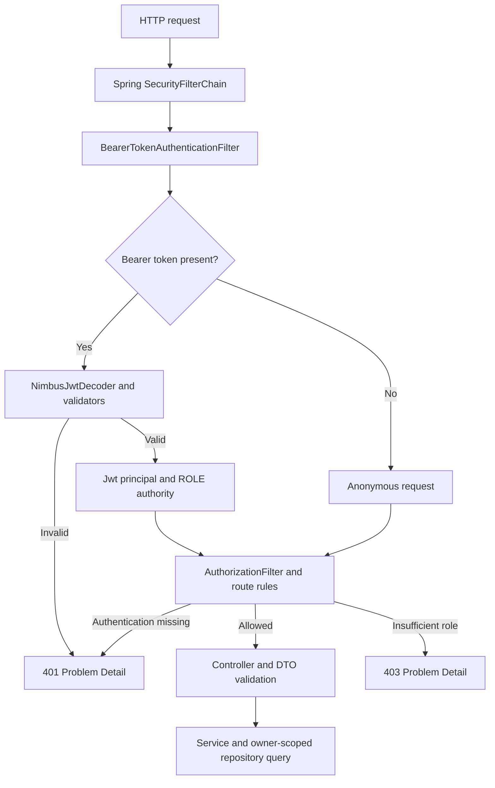

# Authentication and authorization — Phase 6

The application authenticates local accounts with BCrypt and issues short-lived
JWT bearer tokens. Spring Security protects booking routes and checks roles;
booking queries also enforce ownership. Catalogue reads and health remain public.
There is no Redis, Kafka, payment integration, external identity provider, or
OAuth authorization-server flow.

## Account and API lifecycle

1. `POST /api/auth/register` accepts `name`, `email`, and `password`. It returns
   `201` with `UserResponse` (`id`, `name`, `email`, `role`). Registration always
   assigns `USER`; submitting a `role` or another unknown field returns `400`.
2. Registration normalizes accepted email addresses to lowercase, checks for an
   existing account, and stores a salted BCrypt hash with cost 12. The existing
   unique index on `lower(email)` also resolves concurrent duplicate registrations
   to `409`. Registration does not issue a token or verify email ownership.
3. `POST /api/auth/login` accepts `email` and `password`. BCrypt checks the stored
   hash; successful login returns `accessToken`, `tokenType: "Bearer"`, and
   `expiresIn` in seconds. Unknown accounts, disabled legacy accounts, and wrong
   passwords receive the same generic `401`. Unknown/legacy accounts perform a
   BCrypt check against a process-generated dummy hash to reduce timing differences.
4. Protected requests send `Authorization: Bearer <accessToken>`. Tokens in
   query parameters or cookies are not accepted. No HTTP session is created.

Registration passwords must have at least 12 Java string characters and at most
72 UTF-8 bytes. Login also rejects passwords over BCrypt's 72-byte limit, avoiding
silent truncation of Unicode input. Passwords are never trimmed or case-folded.
Credential/token DTOs redact their `toString()` output; responses never contain
password hashes. Spring Security adds cache-control headers, including `no-store`.

## Spring Security filter chain



Spring's resource-server support handles bearer extraction and authentication.
`NimbusJwtDecoder` verifies the signature using only HS256 and validates issuer,
audience, expiry, optional not-before, issued-at, a positive `Long` subject, and
the allowed `USER`/`ADMIN` role claim. Expiry and issued-at are required. Timestamp
validation allows 30 seconds of clock skew. A supplied invalid token is rejected
even on a route that otherwise permits anonymous access.

`JwtAuthenticationConverter` maps the signed role claim to `ROLE_USER` or
`ROLE_ADMIN`. The authenticated principal is the validated `Jwt`; its `sub` is the
database user ID. The authorization filter checks route rules before controllers
run. `SecurityProblemHandler` returns generic `401`/`403` Problem Details for
filter failures; the authentication challenge is `WWW-Authenticate: Bearer`.
Controller advice handles login and domain errors separately.

Form login, HTTP Basic, logout, request caching, and session persistence are
disabled. CSRF is disabled because authentication is exclusively an explicitly
sent bearer header, with no cookie/session authentication. Revisit that decision
before adding authentication cookies. No permissive cross-origin policy has
been added. Error dispatches are allowed so genuine application errors can be
rendered without being replaced by authorization failures.

## Route policy and ownership

| Route / method | Access |
| --- | --- |
| POST `/api/auth/register`, `/api/auth/login` | Public |
| GET/HEAD catalogue routes under `/api/shows` | Public only for the list, detail, and seat routes |
| Health endpoints | Public |
| POST `/api/shows/{showId}/bookings` | USER or ADMIN |
| GET `/api/bookings`, `/api/bookings/{bookingId}` | USER or ADMIN, own bookings only |
| `/api/admin/**` | ADMIN, reserved namespace |
| POST/PUT/PATCH/DELETE catalogue paths | ADMIN, after the specific booking rule |
| Other unmatched requests | Denied by default |

Catalogue mutations are **not implemented**. The security policy reserves writes
under `/api/shows/**`, `/api/movies/**`, `/api/theatres/**`, `/api/screens/**`, and
`/api/seats/**`. Tests confirm an ordinary user's `POST /api/shows` receives `403`,
while an ADMIN passes authorization and receives `405` because no write handler
exists. No test-only production mutation endpoint was introduced.

Booking requests contain only `showSeatId`. A supplied `userId` is rejected as an
unknown property. The controller derives identity from the validated subject and
passes it to `BookingService`; it never trusts a body or query parameter for
ownership. Read queries filter by `user_id` in SQL. Detail lookup combines the
booking ID with the owner ID and returns `404` for missing or foreign bookings,
avoiding disclosure of another user's booking. ADMIN has no ownership bypass.
Booking lists are ordered by creation time descending, then ID descending, and
are currently unpaged.

Authentication occurs before the existing booking transaction. The conditional
PostgreSQL availability update, READ COMMITTED isolation, rollback boundary, and
`uq_bookings_show_seat` remain unchanged. Signed requests still contend on the
same database row; JWT does not replace database concurrency control.

## JWT configuration and trust boundary

| Variable | Meaning |
| --- | --- |
| `JWT_SECRET` | Required Base64 encoding of at least 32 random bytes; no default. |
| `JWT_ISSUER` | Expected issuer, defaults to `tbooker`. |
| `JWT_AUDIENCE` | Expected audience, defaults to `tbooker-api`. |
| `JWT_TTL` | ISO-8601 duration, defaults to `PT15M`; supported range `PT1M`–`PT1H`. |

Generate a local key with `openssl rand -base64 32` and set it in your ignored
`.env`; inject production keys through environment-backed secret management.
Missing, malformed, or short keys fail startup. Test contexts generate a random
key at runtime and never require or persist a production key.

`TokenService` uses Nimbus through Spring's `JwtEncoder` to issue HS256 tokens
containing `iss`, `aud`, `sub`, `iat`, `nbf`, `exp`, `jti`, and `role`. Tokens omit
email and password data. JWT payloads are readable, not encrypted. Possession of
a valid token grants its privileges, so use TLS in deployment and protect tokens
from logs, browser script access, and accidental disclosure.

Nimbus JOSE + JWT 10.10 is explicitly pinned because the resource-server
dependency's transitive Nimbus version is older. Signature/claim handling remains
in the library and Spring adapters, not custom cryptography. Keep dependency
updates and vulnerability review part of later maintenance.

All instances validating HS256 tokens share a secret and therefore can also mint
tokens. This is suitable for the current single application trust boundary.
Asymmetric signing and managed public-key rotation would be preferable if future
independent services should validate tokens without being able to issue them.

## Migration and ADMIN provisioning

V4 adds `users.password_hash` and `users.role`, without changing IDs, emails,
existing bookings, or earlier migrations. `role` is non-null, defaults to `USER`,
and is constrained to `USER`/`ADMIN`. A non-null hash must have BCrypt's stored
format. Legacy and development sample users retain a null hash and cannot log
in. There is no shared default password and no public password-enrollment path
for legacy accounts in this phase; register a new account for local booking.

There is no public role-management or ADMIN-registration API. A trusted database
operator can promote an already registered account through a controlled operation:

```sql
UPDATE tbooker.users SET role = 'ADMIN' WHERE email = 'operator@example.test';
```

This example is an operator action, not part of ordinary application setup.
Re-login is required for a newly issued token to carry the updated role. Never
create a public endpoint accepting arbitrary role assignments.

## LLD patterns and HLD implications

- **Chain of Responsibility:** Spring Security filters perform token processing
  and authorization before the controller layer.
- **Strategy interfaces:** `PasswordEncoder`, `JwtEncoder`, and `JwtDecoder`
  supply framework-backed implementations through constructor injection; BCrypt
  and Nimbus are the configured choices. No custom factory hierarchy is needed.
- **Service Layer, Repository, DTO:** `AuthService` handles registration/login,
  `TokenService` creates tokens, and `BookingService` enforces owner-scoped reads.
  Controllers remain thin, and repositories own persistence queries.
- **Dependency injection and transaction proxies:** Spring provides collaborators
  and preserves service transaction boundaries. Error adapters separate filter
  authentication failures from domain exceptions.

Stateless validation avoids a shared session store for future application replicas.
It also removes an immediate session-revocation mechanism. Authorization has two
layers: route roles control operations, while owner-scoped queries prevent
insecure direct object reference access to booking records. Database constraints
remain authoritative for storage integrity.

## Verification and remaining limits

Integration tests exercise actual signed tokens, the security filter chain, and
Testcontainers PostgreSQL. They cover registration/hash storage, concurrent and
case-insensitive duplicates, login errors, malformed/expired/unsigned/wrong-key
tokens, issuer/audience/subject/role checks, missing credentials, privilege
injection, ownership, ADMIN rules, and legacy migration. Existing rollback and
20-request booking races now use real signed tokens as well. See [TESTING.md](TESTING.md)
for executed counts rather than inferring success from this list.

- No refresh tokens, logout revocation, token denylist, key overlap/rotation
  protocol, MFA, password reset, email verification, or self-service legacy
  account enrollment exists.
- Token role changes are not checked against the database on every request.
  Old privileges remain until expiry (plus clock skew) or signing-key replacement.
  A missing user still cannot book because the service verifies that user exists.
- No login/registration rate limiting or lockout is implemented. BCrypt mitigates
  offline guessing but costs CPU; registration also occupies a database transaction
  during hashing. A public deployment needs abuse controls and measurement.
- Duplicate registration deliberately reveals that an email is registered; login
  uses generic errors and dummy hashing but is not claimed to be constant-time.
- TLS termination, secret rotation operations, security audit events, recovery,
  and production monitoring remain deployment work. No penetration test or
  multi-instance security/performance guarantee is claimed.
- Existing booking limits still apply: no idempotency, booking-specific database
  lock timeout, scheduling overlap check, holds, cancellation, or payments.
